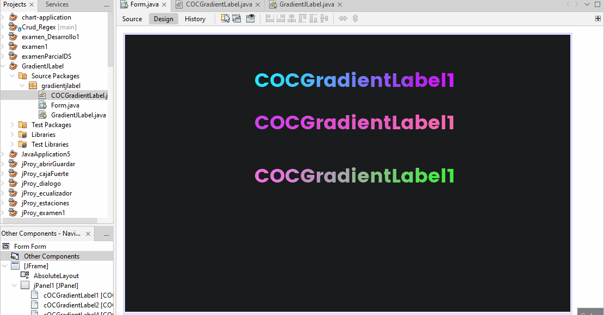

# GradientJLabel
# Demostración:

# Como usarlo

- Desde tu **Paletta** de controles, relizar anticlick y selecciona **Palette Manager** selecciona **Add From Jar** y busca el archivo Jar.
Seleccionalo y continua, selecciona **COCGradientLabel* componente y procede a
seleccionar la categoria y de click en **Finish**.

## Descargar Jar

[COCGradientLabel Jar](https://github.com/CristianOlivera1/GradientJLabel/blob/main/captura/COCGradientLabel.jar)

